# 言寺日程

一个本地优先的中文日程管理应用，温暖纸张质感日历界面。支持 Web、Chrome 扩展、Tauri 桌面端和 Android 移动端。

<p align="center">
  
</p>

## 功能

- **周视图** — 课程表式日程布局，点击空白时间段快速创建
- **月视图** — 整月日历网格，单击选日、双击创建
- **日程管理** — 标题、日期、时间、颜色标签、备注，时间冲突自动检测
- **模板系统** — 保存常用日程模板，一键复用
- **自定义配色** — 预设颜色 + 自定义 HEX 色签
- **数据导入导出** — JSON 格式备份与恢复
- **系统通知** — 日程开始前 60 分钟自动提醒（Android 支持悬浮通知）
- **多端同步** — 注册登录后日程、模板、色签自动云端同步
- **移动端适配** — 沉浸式状态栏、底部操作栏、居中管理浮窗

## 技术栈

| 层级 | 技术 |
|---|---|
| 前端 | Vue 3 + Vite 8 + Pinia 3 + Tailwind CSS 4 |
| 日期 | Day.js |
| 桌面/移动 | Tauri 2（Rust 后端，Android 支持） |
| 后端 | Express + better-sqlite3 + JWT 认证 |
| 测试 | Vitest |

## 快速开始

```bash
# 安装依赖
npm install

# 启动前端开发服务器
npm run dev

# 启动后端服务（需要先配置 server/.env）
cd server && npm install && npm run dev
```

### 后端配置

复制 `server/.env.example` 为 `server/.env`，配置必要环境变量：

```env
JWT_SECRET=your-secret-key-here
CORS_ORIGIN=http://localhost:5173
```

## 开发命令

| 命令 | 说明 |
|---|---|
| `npm run dev` | 启动 Web 开发服务器 |
| `npm run build` | 构建生产版本 |
| `npm run preview` | 预览生产构建 |
| `npm test` | 运行测试（21 个用例） |
| `npm run test:watch` | 测试监听模式 |
| `npm run tauri:dev` | Tauri 桌面端开发 |
| `npm run tauri:build` | 构建桌面端安装包 |
| `npm run tauri:android:dev` | Tauri Android 开发 |
| `npm run tauri:android:build` | 构建 Android APK/AAB |

### Android 环境

Android 打包需要 Android SDK、NDK、JDK 和 Rust Android target。Windows 环境如命令行未继承用户环境变量：

```powershell
$env:ANDROID_HOME=[Environment]::GetEnvironmentVariable('ANDROID_HOME','User')
$env:NDK_HOME=[Environment]::GetEnvironmentVariable('NDK_HOME','User')
```

## 项目结构

```
src/
  api/                 # 后端 API 客户端（认证、日程同步）
  components/
    calendar/          # 周视图、月视图、工具栏
    schedule/          # 日程编辑与批量创建弹窗
  stores/              # Pinia 状态管理（日程、日历、模板、色签）
  styles/              # 全局样式与 CSS 变量
  utils/               # 日期、日历布局、存储、通知、导出工具
  views/               # 页面视图（日历、登录）
  __tests__/           # 单元测试
server/
  src/
    index.js           # Express 服务入口（CORS、限流、错误处理）
    auth.js            # JWT 认证（注册、登录、权限中间件）
    database.js        # SQLite 数据库初始化
    schedules.js       # 日程 CRUD + 批量同步
    templates.js       # 模板管理
    palettes.js        # 色签管理
src-tauri/             # Tauri 桌面端与 Android 配置
public/                # 静态资源与 Chrome 扩展清单
```

## 架构设计

### 数据流

```
CalendarView.vue
  ├── CalendarToolbar.vue     # 视图切换、日期导航
  ├── WeekCalendar.vue        # 周视图网格
  ├── MonthCalendar.vue       # 月视图网格
  ├── ScheduleDialog.vue      # 单条日程编辑
  └── BatchScheduleDialog.vue # 模板批量创建
```

### 存储层

- **`src/utils/api.js`** — 存储抽象层，登录状态走远程 API，未登录走本地
- **Chrome 扩展** — `chrome.storage.local`
- **Tauri/Web** — `localStorage`
- **后端同步** — RESTful API + SQLite

### 安全措施

- JWT 密钥强制环境变量配置，启动时校验
- 登录/注册速率限制（15 分钟 20 次）
- CORS 域名白名单
- 请求体大小限制（1MB）
- Sync 路由逐项数据格式验证

## 发版产物

```
src-tauri/target/release/言寺日程.exe                    # Windows 可执行文件
src-tauri/target/release/bundle/msi/言寺日程_0.1.0_x64_en-US.msi    # MSI 安装包
src-tauri/target/release/bundle/nsis/言寺日程_0.1.0_x64-setup.exe   # NSIS 安装包
src-tauri/gen/android/app/build/outputs/apk/universal/release/app-universal-release.apk  # Android APK
src-tauri/gen/android/app/build/outputs/bundle/universalRelease/app-universal-release.aab # Android AAB
```

## 界面预览

<details>
<summary>展开截图</summary>

| 桌面端 | 移动端 |
| --- | --- |
| 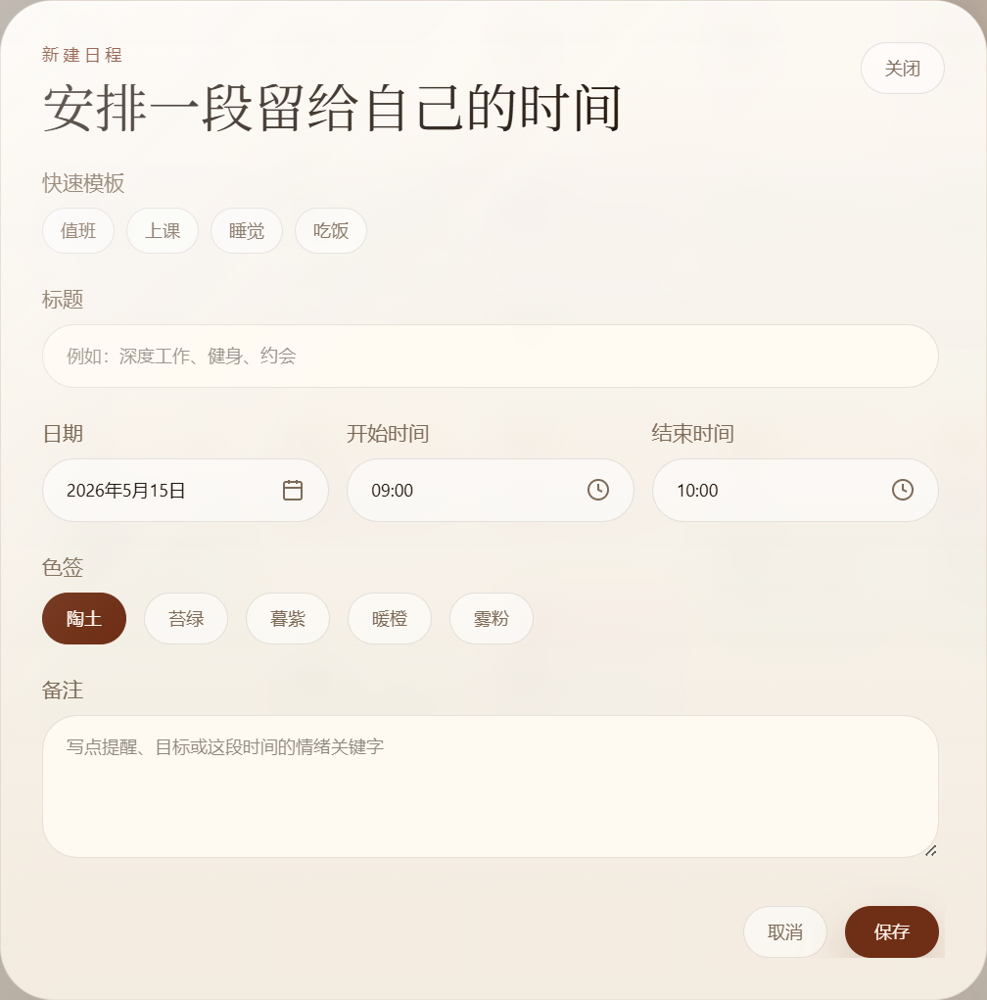 | 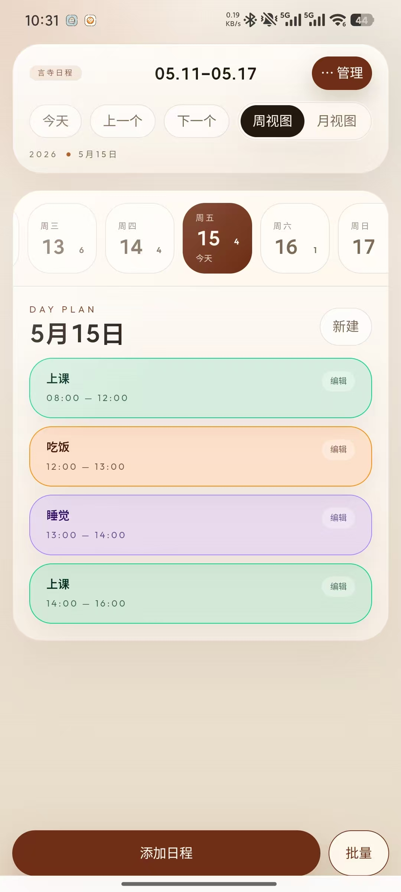 |
| 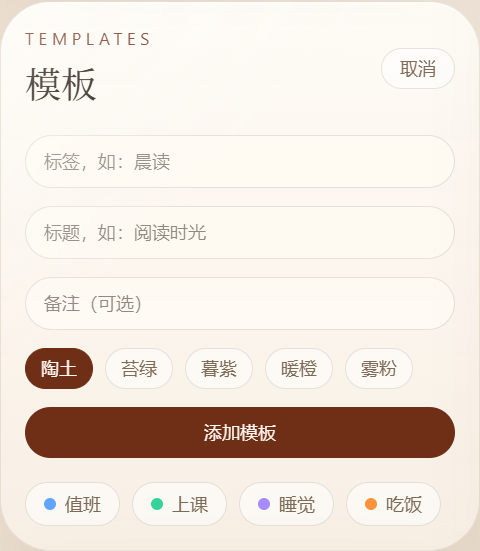 | 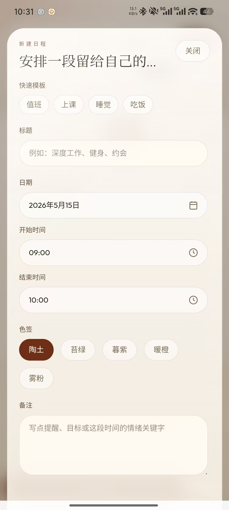 |
| 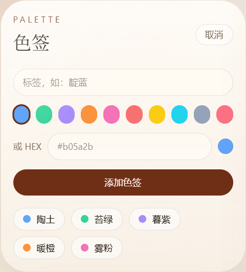 | 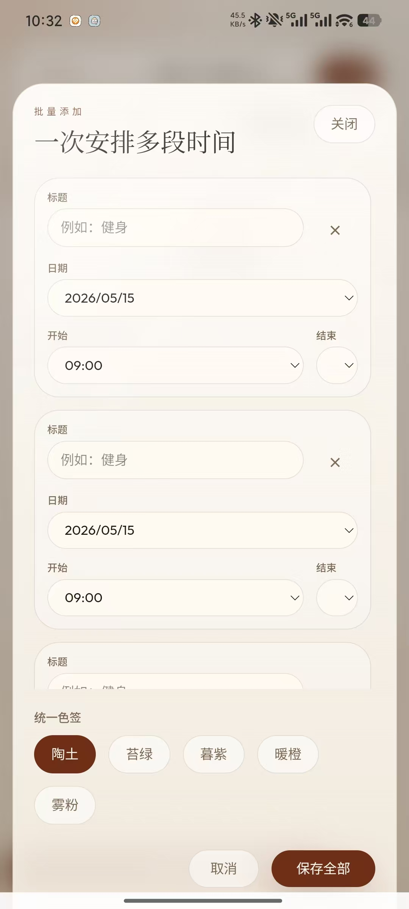 |
| 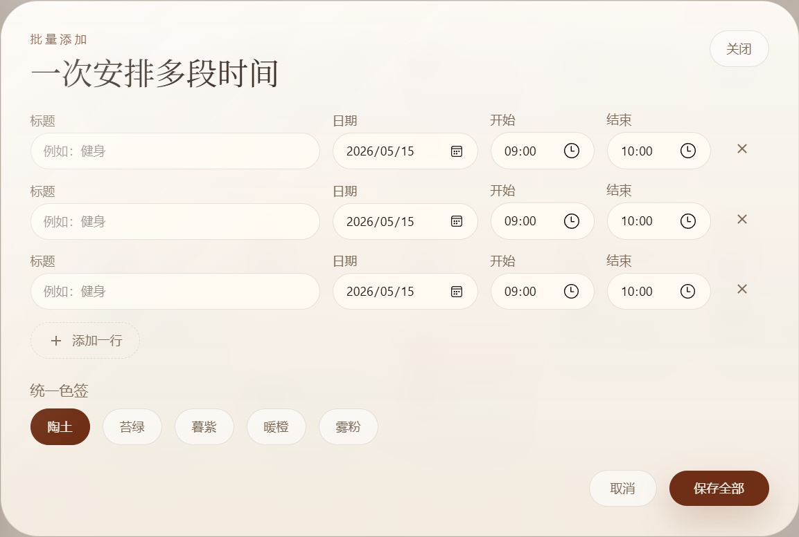 | 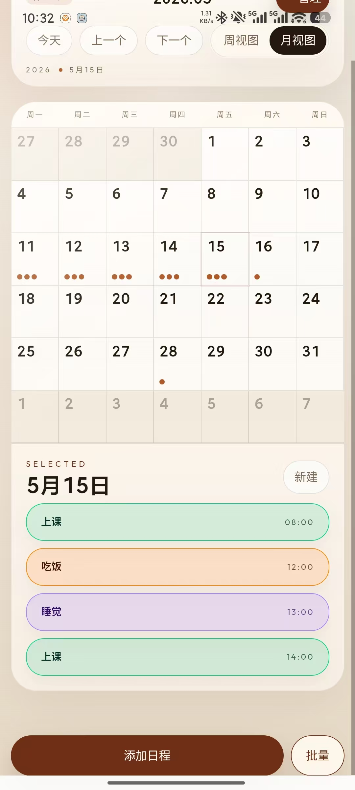 |
|  | 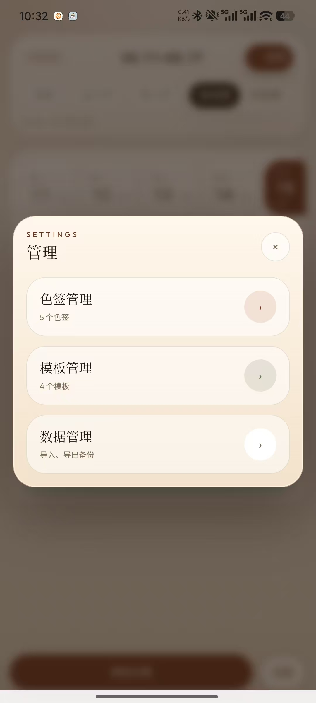 |
| | 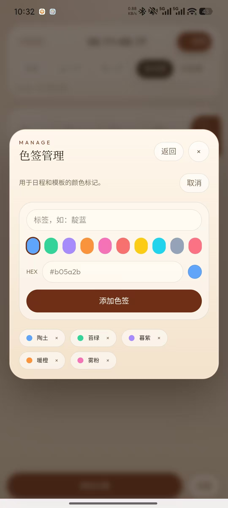 |
| | 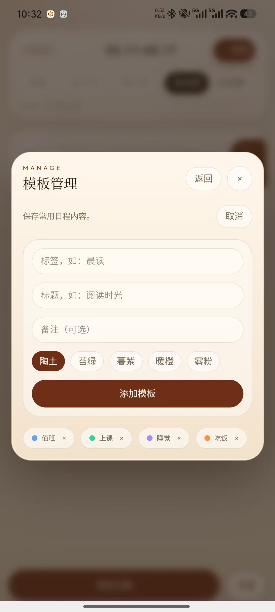 |

</details>
